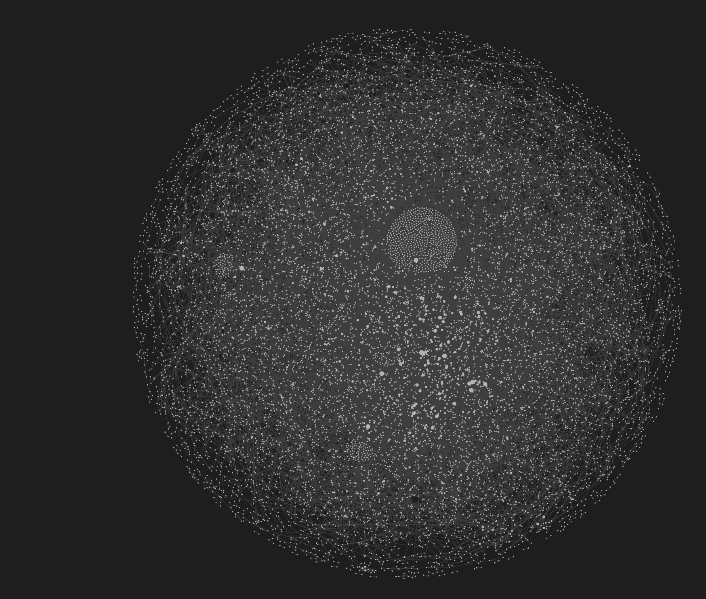

# agentmemory

Persistent memory for AI coding agents. When you close a session and open a new one, the agent starts from scratch. agentmemory fixes that.

It records what you discuss, what you decide, what you correct, and what works. Next session, the agent already knows your project, your preferences, and what was tried before. No manual context files. No copy-pasting from last session. It just remembers.

**[Full writeup at robotrocketscience.com/projects/agentmemory](https://robotrocketscience.com/projects/agentmemory)**

## Installation

You need [uv](https://docs.astral.sh/uv/) (Python package manager) and [Claude Code](https://docs.anthropic.com/en/docs/claude-code) installed first.

### Step 1: Install agentmemory

```bash
uv pip install git+https://github.com/yoshi280/agentmemory.git
```

Verify it installed:

```bash
agentmemory --help
```

If you get `command not found`, try installing as a tool instead:

```bash
uv tool install git+https://github.com/yoshi280/agentmemory.git
```

### Step 2: Run setup

```bash
agentmemory setup
```

This does three things:
1. Writes `/mem:*` slash commands to `~/.claude/commands/mem/`
2. Registers the MCP server in your project's `.mcp.json`
3. Adds session hooks to `~/.claude/settings.json` (context injection, conversation logging)

### Step 3: Restart Claude Code

Close and reopen Claude Code. The MCP server starts automatically on launch.

### Step 4: Verify it works

In Claude Code, run:

```
/mem:status
```

You should see a status report with belief counts, session info, and system health. If you see an error, check Troubleshooting below.

### Step 5: Onboard your project

```
/mem:onboard .
```

This scans your project directory and ingests structure from git history, code, docs, and configuration. Takes 10-30 seconds depending on project size.

That's it. agentmemory is now running. It will automatically capture decisions, corrections, and context from your conversations. Next session, your agent starts with that context already loaded.

### Troubleshooting

| Problem | Fix |
|---------|-----|
| `agentmemory: command not found` | Run `uv tool install git+https://github.com/yoshi280/agentmemory.git` or check that `~/.local/bin` is in your PATH |
| `/mem:status` returns an error | Restart Claude Code. The MCP server needs a fresh start after setup |
| Slash commands not showing up | Run `agentmemory setup` again, then restart Claude Code |
| MCP tools not responding | Check `.mcp.json` exists in your project root. If not, run `agentmemory setup` from the project directory |
| SQLite lock errors | Run `agentmemory health` to diagnose, or manually clear the WAL: `python3 -c "import sqlite3; sqlite3.connect('~/.agentmemory/projects/<hash>/memory.db').execute('PRAGMA wal_checkpoint(TRUNCATE)')"` |

## Quick Start

Once installed, these are the commands you'll use most:

```
/mem:search "topic"         # Find what the agent knows about a topic
/mem:core 10                # See the top 10 highest-confidence beliefs
/mem:wonder "topic"         # Broad research with graph context
/mem:reason "question"      # Focused hypothesis testing against evidence
/mem:stats                  # System analytics
/mem:locked                 # Show locked constraints (non-negotiable rules)
```

From the CLI:

```bash
agentmemory search "query terms"
agentmemory core --top 10
agentmemory stats
```

## Workflow

The core loop is: discuss, explore, focus, build, repeat.

1. **Discuss.** Start talking about a topic with your agent. agentmemory automatically captures decisions, corrections, and preferences from the conversation. You don't need to do anything special -- just work normally.

2. **Explore.** When you want a wider view, run `/mem:wonder "topic"`. Wonder spawns parallel research agents that pull from the belief graph, web sources, and documentation to surface perspectives and hypotheses you haven't considered. It produces structured output with uncertainty signals so you can see what's well-supported vs. speculative.

3. **Focus.** When you're ready to commit to a direction, run `/mem:reason "question"`. Reason does graph-aware hypothesis testing -- it traces evidence chains, identifies contradictions, and finds the highest-leverage entry points. It tells you what the evidence supports, where the gaps are, and what to investigate next.

4. **Build.** Take the output from wonder/reason into a few more discussion turns to refine the plan, then implement. agentmemory captures what you build and the decisions behind it.

5. **Repeat.** Next session, the agent already has the context. Wonder and reason get sharper as the belief graph grows, because there's more evidence to reason over and more connections to traverse.

## How It Works

Conversations become scored beliefs. Beliefs get stronger when they help, weaker when they hurt. The system learns what matters over time.

- **Bayesian confidence** -- Beta-Bernoulli model with Thompson sampling. Beliefs that help get stronger; beliefs that hurt get weaker.
- **Multi-layer retrieval** -- Locked constraints (L0) + behavioral directives (L1) + FTS5 keyword search (L2) + HRR structural bridge + BFS graph traversal (L3). Compressed to fit a token budget.
- **Graph-backed knowledge** -- 12 edge types (SUPERSEDES, CONTRADICTS, SUPPORTS, CALLS, CITES, TESTS, IMPLEMENTS, RELATES_TO, TEMPORAL_NEXT, CO_CHANGED, CONTAINS, COMMIT_TOUCHES) enable multi-hop traversal and contradiction detection.
- **Correction detection** -- 92% accuracy, zero LLM cost. Corrections auto-create high-confidence beliefs.
- **LLM classification** -- Haiku classifies belief type/persistence at 99% accuracy, ~$0.005/session.
- **Project onboarding** -- 8 extractors pull structure from git history, AST, docs, citations, tests, implementations, and directives.
- **Temporal decay** -- Content-aware half-lives (facts 14 days, corrections 8 weeks, requirements 24 weeks). Session velocity scaling.
- **Per-project isolation** -- Each project gets its own SQLite database at `~/.agentmemory/projects/<hash>/`.

## Privacy and Security

These are verifiable properties of the codebase, not marketing claims. Each can be confirmed by reading the source.

**Your data never leaves your machine.** The MCP server, retrieval pipeline, scoring, and all belief operations run locally using SQLite and pure math (Bayesian updates, FTS5, HRR). The only network-capable code is `telemetry.py` (stdlib `urllib.request`), which is only invoked when you explicitly run `agentmemory send-telemetry` after opting in. No network calls happen during normal operation. The LLM classification step during onboarding uses Claude Code subagents (not direct API calls from agentmemory).

**No telemetry by default.** Telemetry is disabled on install (`config.py` defaults `telemetry.enabled = false`). If you opt in during `agentmemory setup`, only content-free metrics are recorded: token counts, correction rates, feedback ratios, belief lifecycle counts. No belief content, project paths, file paths, session IDs, or user-identifying information is ever included. Data is stored locally at `~/.agentmemory/telemetry.jsonl` and never transmitted automatically. To share your usage data, run `agentmemory send-telemetry` -- it shows you exactly what will be sent and asks for confirmation before transmitting. You can also email telemetry data to data@robotrocketscience.com. Disable anytime with `/mem:disable-telemetry`.

**Per-project isolation.** Each project gets a separate SQLite database keyed by SHA-256 hash of the project path. Beliefs from project A cannot leak into project B. Cross-project queries require explicit opt-in via the `project_path` parameter and are read-only (no feedback or confidence updates to the foreign database). Mutation tools (`feedback`, `lock`, `delete`) reject cross-project belief IDs.

**You control all writes.** Beliefs created by `remember()` and `correct()` are not locked until you explicitly confirm via `lock()`. Only locked beliefs persist as non-negotiable constraints. You can soft-delete any belief with `/mem:delete`, and the system cannot create locked beliefs without your confirmation.

**SQLite only.** No external database, no vector DB, no cloud storage. All data lives in `~/.agentmemory/`. WAL mode for crash safety. Fully rebuildable from source files.

**When the cloud LLM is involved.** When agentmemory injects context into your Claude Code prompt, the cloud LLM provider (Anthropic) sees that context as part of the prompt. This is inherent to using any cloud LLM. agentmemory mitigates exposure by injecting only the relevant subset of beliefs (2,000 token budget) rather than a full memory dump, and per-project isolation prevents cross-project context bleed.

## `/mem:` Command Reference

All commands are available as Claude Code slash commands after setup.

| Command | Description |
|---------|-------------|
| `/mem:search <query>` | Search beliefs relevant to a query |
| `/mem:remember <text>` | Store a new belief |
| `/mem:correct <text>` | Record a user correction (supersedes conflicting beliefs) |
| `/mem:lock <belief_id>` | Lock a belief as a permanent constraint |
| `/mem:locked` | Show all locked beliefs |
| `/mem:onboard <path>` | Scan and ingest a project directory |
| `/mem:status` | System analytics |
| `/mem:core [n]` | Top N beliefs by confidence |
| `/mem:stats` | Detailed analytics |
| `/mem:reason <question>` | Graph-aware hypothesis testing |
| `/mem:wonder <topic>` | Deep research with graph context |
| `/mem:feedback <id> <outcome>` | Provide feedback on a belief (used/harmful/ignored) |
| `/mem:delete <id>` | Soft-delete a belief |
| `/mem:settings` | View or update settings |
| `/mem:enable-telemetry` | Enable anonymous performance logging |
| `/mem:disable-telemetry` | Disable anonymous performance logging |
| `/mem:disable` | Disable agentmemory for the session |
| `/mem:enable` | Re-enable agentmemory |
| `/mem:help` | Command reference |

## Obsidian Integration

agentmemory can sync its belief graph into an [Obsidian](https://obsidian.md) vault. Each belief becomes a markdown note with YAML frontmatter and wikilinked edges, so you can browse, search, and visualize your agent's knowledge using Obsidian's graph view and Dataview plugin.



### Setup

```bash
# Point agentmemory at your vault
agentmemory settings obsidian.vault_path ~/obsidian-vault

# Sync beliefs to the vault (incremental, only writes changes)
agentmemory sync-obsidian
```

Or from Claude Code:

```
/mem:settings obsidian.vault_path ~/obsidian-vault
```

Sync is one-way by default (agentmemory -> Obsidian). Beliefs appear as markdown files in a `beliefs/` subfolder with auto-generated index notes grouped by type, confidence, and recency. The sync is incremental -- it tracks content hashes and only writes files that changed.

For bidirectional sync, use `/mem:import-obsidian` to pull edits made in Obsidian back into the belief store.

## Architecture

```
                            INGESTION
                            =========

  Conversation Turn              Project Directory
        |                              |
        v                              v
  +-------------+              +--------------+
  |   ingest()  |              |  scanner.py  |
  | extraction  |              | 9 extractors |
  | + sentences |              | (files, git, |
  +------+------+              |  AST, docs)  |
         |                     +------+-------+
         v                            v
  +-------------+              +--------------+
  | correction  |              |  graph_edges |
  |  detection  |              | CALLS, CITES |
  | (92%, 0-LLM)|             | TESTS, IMPL  |
  +------+------+              | CO_CHANGED   |
         |                     +--------------+
         v
  +-------------+
  | classify    |          STORAGE
  | (Haiku LLM  |         =======
  |  99% acc.)  |
  +------+------+    +-------------------+
         |          | SQLite (WAL mode)  |
         +--------->| beliefs table      |
                    | FTS5 search index  |
                    | edges (7 types)    |
                    | sessions, evidence |
                    | confidence_history |
                    +--------+----------+
                             |
                             v

                        RETRIEVAL
                        =========

              +-----------------------+
              | L0: Locked beliefs    |
              | (always in context)   |
              +-----------+-----------+
                          |
              +-----------+-----------+
              | L1: Behavioral beliefs|
              | (directives, rules)   |
              +-----------+-----------+
                          |
              +-----------+-----------+
              | L2: FTS5 keyword      |
              | search (BM25 ranked)  |
              +-----------+-----------+
                          |
              +-----------+-----------+
              | L2.5: Entity-index    |
              | expansion             |
              +-----------+-----------+
                          |
              +-----------+-----------+
              | L3: HRR vocabulary    |
              | bridge + BFS graph    |
              +-----------+-----------+
                          |
                          v
                +------------------+
                | Score + Pack     |
                | (Thompson sample |
                |  * type weight   |
                |  * source weight |
                |  * temporal decay|
                |  * recency boost)|
                +--------+---------+
                         |
                         v
                2000-token context
                injected per prompt
                         |
                         v
                +--------+---------+
                |   feedback()  |
                | Bayesian      |
                | update:       |
                |  used  -> a+1 |
                |  ignored -> 0 |
                |  harmful -> b+|
                +-------+-------+
                        |
                        v
              Confidence adjusts over time
              (Thompson sampling explores
               uncertain beliefs)
```

## Benchmarks (v1.1.1)

Evaluated across 5 published benchmarks. All results are protocol-correct with
contamination-proof isolation (separate GT files, verified by `verify_clean.py`).
No embeddings, no vector DB.

| Benchmark | Metric | agentmemory | Best Published | Delta |
|---|---|---|---|---|
| LoCoMo (ACL 2024) | F1 | **66.1%** | 51.6% (GPT-4o-turbo) | +14.5pp |
| MAB SH 262K (ICLR 2026) | SEM | **90%** Opus / **62%** Haiku | 45% (GPT-4o-mini) | +45pp / +17pp |
| MAB MH 262K (ICLR 2026) | SEM | **60%** Opus | <=7% (all methods) | **8.6x ceiling** |
| StructMemEval (2026) | Accuracy | **100%** (14/14) | vector stores fail | temporal_sort fix |
| LongMemEval (ICLR 2025) | Opus judge | **59.0%** | 60.6% (GPT-4o) | -1.6pp |

Full methodology, contamination protocol, and per-benchmark details in [docs/BENCHMARK_RESULTS.md](docs/BENCHMARK_RESULTS.md).
Research article at [robotrocketscience.com/projects/agentmemory](https://robotrocketscience.com/projects/agentmemory).

## Research

84 experiments during core development, plus 6 benchmark-phase experiments.
Each experiment had a pre-registered hypothesis, measurement protocol,
documented results, and an explicit proceed/revise/abandon decision.

| Document | Contents |
|---|---|
| [BENCHMARK_RESULTS.md](docs/BENCHMARK_RESULTS.md) | All benchmark scores, methodology, version progression |
| [BENCHMARK_PROTOCOL.md](docs/BENCHMARK_PROTOCOL.md) | Contamination-proof evaluation protocol |
| [RESEARCH_FREEZE_20260416.md](docs/RESEARCH_FREEZE_20260416.md) | Final findings, ceilings, future levers |

Experiment logs in `research/EXPERIMENTS.md`. Case studies in `research/CASE_STUDIES.md`.

## Development

```bash
git clone https://github.com/yoshi280/agentmemory.git
cd agentmemory
uv sync --all-groups
uv run pytest tests/ -x -q
uv run pyright src/                # strict mode, 0 errors
```

## License

MIT
