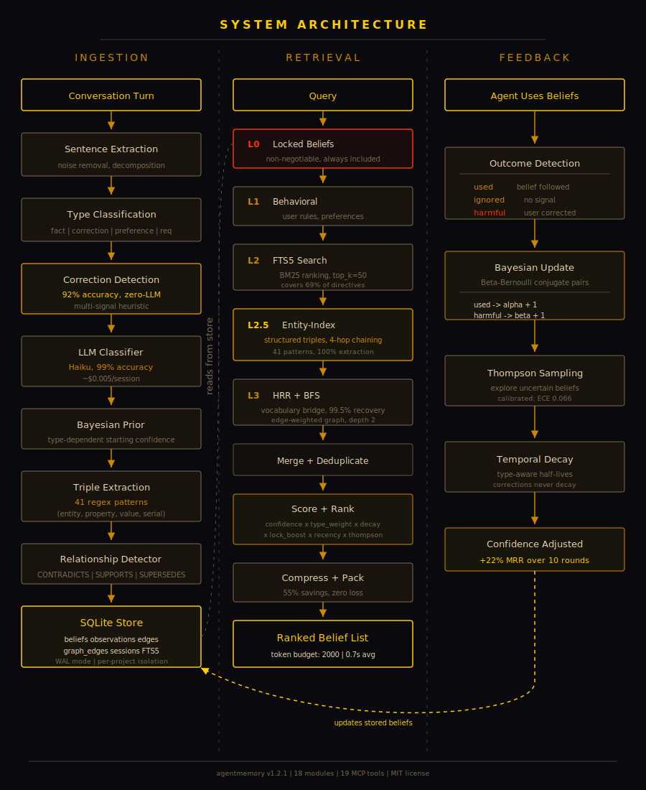

[← Chapter 4 - Obsidian Integration](OBSIDIAN.md) · [Contents](README.md) · Next: [Chapter 6 - Privacy and Security →](PRIVACY.md)

# Chapter 5. Architecture

Conversations become scored beliefs. Beliefs get stronger when they help, weaker when they hurt. The system learns what matters over time.

- **Bayesian confidence.** Beta-Bernoulli model with Thompson sampling. Beliefs that help get stronger; beliefs that hurt get weaker.
- **Multi-layer retrieval.** Locked constraints (L0) + behavioral directives (L1) + FTS5 keyword search (L2) + entity-index expansion (L2.5) + HRR structural bridge + BFS graph traversal (L3). Compressed to fit a token budget.
- **Graph-backed knowledge.** 16 edge types: 12 core (SUPERSEDES, CONTRADICTS, SUPPORTS, CALLS, CITES, TESTS, IMPLEMENTS, RELATES_TO, TEMPORAL_NEXT, CO_CHANGED, CONTAINS, COMMIT_TOUCHES) + 4 speculative (SPECULATES, DEPENDS_ON, RESOLVES, HIBERNATED). Multi-hop traversal, contradiction detection, and consequence-path reasoning.
- **Correction detection.** 92% accuracy on tested corpus (Exp 1 V2, zero-LLM). Corrections auto-create high-confidence beliefs.
- **LLM classification.** Haiku classifies belief type/persistence at 99% accuracy (Exp 47/50), estimated ~$0.005/session.
- **Project onboarding.** 8 extractors pull structure from git history, AST, docs, citations, tests, implementations, and directives.
- **Temporal decay.** Content-aware half-lives (facts 14 days, corrections 8 weeks, requirements 24 weeks). Session velocity scaling.
- **Per-project isolation.** Each project gets its own SQLite database at `~/.agentmemory/projects/<hash>/`.

For deeper architecture notes see [V2_ARCHITECTURE.md](V2_ARCHITECTURE.md).

---

[← Chapter 4 - Obsidian Integration](OBSIDIAN.md) · [Contents](README.md) · Next: [Chapter 6 - Privacy and Security →](PRIVACY.md)
